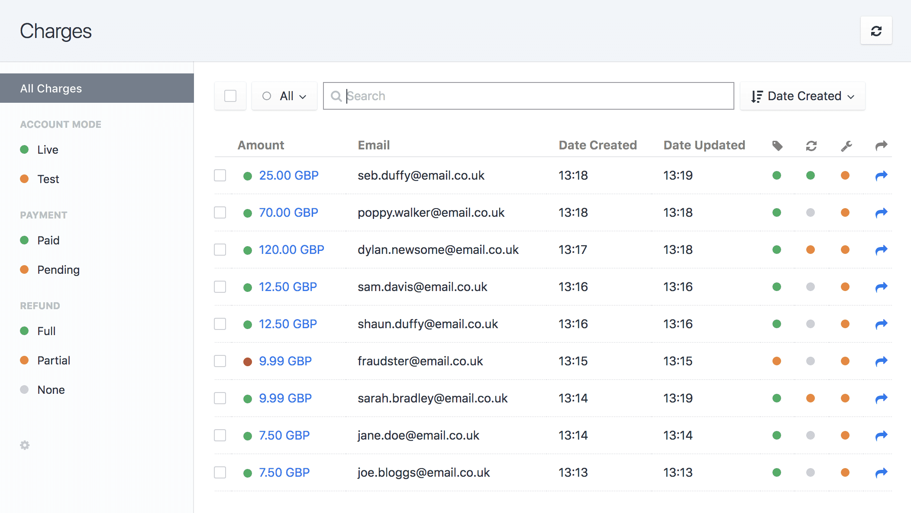

# Stripe Checkout plugin for Craft CMS 3

Bringing the power of Stripe Checkout to your Craft templates.

## Documentation

### Installation

- [Installation](docs/installation.md)

### Configuration

- [General Config](docs/general-config.md)

### Core Concepts

- [Charges](docs/charges.md)

### Getting Elements

- [craft.stripecheckout.charges](docs/craft-stripecheckout-charges.md)

### Template Guides

- [Available Variables](docs/available-variables.md)
- [Creating Charges](docs/creating-charges.md)
- [Default Templates](docs/default-templates.md)

## Stripe Checkout Roadmap

Some things to do, and ideas for potential features:

* Release it

Brought to you by [Luke Youell](https://github.com/lukeyouell/craft-stripecheckout)
